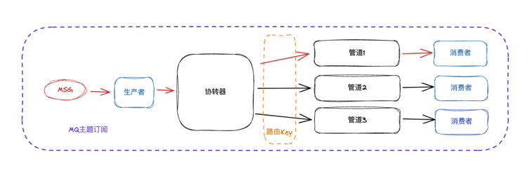

# rabbitMQ

## 目录
- amqp 官方案例代码 [文档](https://www.rabbitmq.com/tutorials/tutorial-three-go.html)
- reabbitMQ 容器部署
- demo 编写的案例
## 操作
- 启动
`docker run -d -it --rm --name rabbitmq -p 5672:5672 -p 15672:15672 rabbitmq:3.8-management`
***注意:*** 此命令中使用了 --rm 参数，使用这个参数会时，容器退出时关闭清楚容器自身(其含义就是这个容器没有终止状态，内部的有状态数据会被删除)
- 关闭 `docker stop rabbitmq`

## 备注
官方教程十分完善(和kafka相比)，多种场景已经在文档案列中给以解释与代码案例。

## 问题：
- 1、发布/订阅者模式，如果订阅者没有启动，先启动发布者，会直接丢失信息？

## demo图
